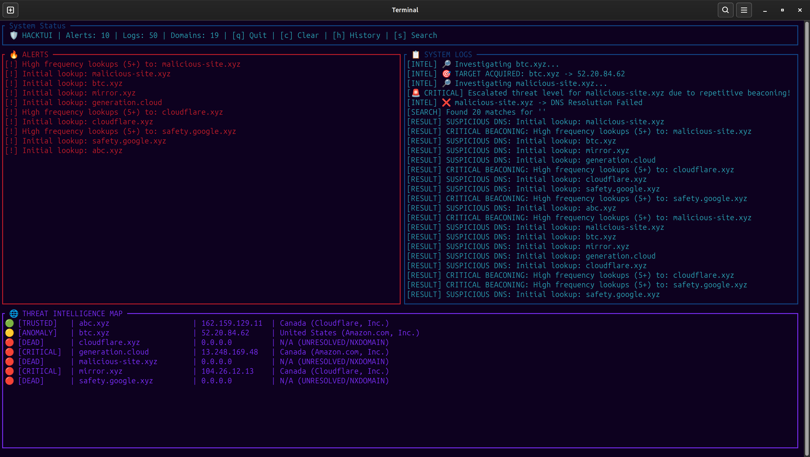

# HackTUI 

    ██╗  ██╗ █████╗  ██████╗██╗  ██╗ ████████╗██╗   ██╗██╗
    ██║  ██║██╔══██╗██╔════╝██║ ██╔╝ ╚══██╔══╝██║   ██║██║
    ███████║███████║██║     █████╔╝     ██║   ██║   ██║██║
    ██╔══██║██╔══██║██║     ██╔═██╗     ██║   ██║   ██║██║
    ██║  ██║██║  ██║╚██████╗██║  ██╗    ██║   ╚██████╔╝██║
    ╚═╝  ╚═╝╚═╝  ╚═╝ ╚═════╝╚═╝  ╚═╝    ╚═╝    ╚═════╝ ╚═╝

------------------------------------------------------------------------

##  Project Overview

HackTUI is a unified **SIEM (Security Information & Event Management)** and 
**NDR (Network Detection & Response)** platform built on the Elixir/OTP runtime. 
By combining real-time packet inspection (NDR) with persistent forensic 
storage and correlation (SIEM), it transforms raw system telemetry into 
actionable security intelligence.

------------------------------------------------------------------------

##  Dashboard Preview



*Figure 1: Real-time correlation of DNS beaconing events and GeoIP
enrichment.*

------------------------------------------------------------------------

##  Advanced SIEM Features

* **Stateful Correlation Engine**
    Tracks behavioral patterns over time. It automatically escalates repetitive suspicious lookups from standard warnings to **CRITICAL** alerts to highlight potential malware beaconing.

* **Asynchronous Threat Enrichment**
    Leverages a dedicated enrichment worker to perform non-blocking DNS resolution and GeoIP lookups (Country, ISP) for flagged domains without interrupting packet ingestion.

* **Persistent Historical Storage**
    Integrated with **PostgreSQL** via Ecto. All security events are serialized to a permanent data store, allowing for deep forensic analysis and historical trend reporting.

* **Interactive Forensic Search**
    Investigators can toggle Search Mode (press **[s]**) to query the PostgreSQL backend for specific domains or alert patterns, retrieving historical telemetry instantly.

* **Fault-Tolerant Design**
    Built on the Erlang/OTP supervision tree. Individual components are isolated; a failure in one component does not compromise the stability of the entire SOC.

------------------------------------------------------------------------

## 🌐 Threat Intelligence & Risk Assessment

HackTUI features a custom Risk Engine that classifies network connections based on ISP reputation, domain TLD, and resolution status:

| Indicator | Status | Context |
| :--- | :--- | :--- |
| 🟢 **[TRUSTED]** | Verified | Known-safe corporate infrastructure (Google, Amazon, Cloudflare). |
| 🟡 **[ANOMALY]** | Warning | Suspicious TLDs (.xyz, .cloud) utilizing reputable CDNs to mask origin. |
| 🔴 **[CRITICAL]**| High Risk | High-risk TLDs on unknown or non-reputable infrastructure. |
| 🔴 **[DEAD]** | NXDOMAIN | Unresolved domains, often indicative of DGA (Domain Generation Algorithms). |

------------------------------------------------------------------------

##  Architecture

The system operates as a supervised tree of specialized concurrent
processes:

-   **NetScout** -- Ingestion layer managing raw packet capture via
    `tcpdump`.
-   **Enricher** -- Intelligence layer providing GeoIP and Threat Intel
    metadata.
-   **Repo** -- Persistence layer managing the PostgreSQL interface.
-   **State** -- Correlation engine and single source of truth.
-   **Dashboard** -- Terminal rendering engine built on `ExRatatui`.

------------------------------------------------------------------------

##  Installation & Setup

### 1️⃣ System Dependencies

Monitoring agents require specific Linux capabilities:

``` bash
# Grant network sniffing permissions
sudo setcap 'cap_net_raw,cap_net_admin=eip' $(which tcpdump)
```

``` bash
# Grant journal access
sudo usermod -a -G systemd-journal $USER
```

Log out and back in after modifying group permissions.

------------------------------------------------------------------------

### 2️⃣ Environment Configuration

Create a `.env` file in the project root:

``` bash
# .env
export HACKTUI_DB_PASS="your_secure_30_character_password"
```

------------------------------------------------------------------------

### 3️⃣ Database Initialization

``` bash
source .env
mix deps.get
mix ecto.setup
```

------------------------------------------------------------------------

## ▶ Usage

``` bash
source .env
mix run --no-halt
```

------------------------------------------------------------------------

## 🎛️ Controls

  Key   Action
  ----- ---------------------------------------
  q     Graceful Shutdown
  c     Clear In-Memory Alerts
  h     Fetch Historical Alerts from Database
  s     Search 

------------------------------------------------------------------------

##  Tech Stack

-   **Language:** Elixir 1.19+ (OTP 28)
-   **Database:** PostgreSQL 16+ (Ecto)
-   **Networking:** Req (HTTP), Port-based TCPDump
-   **TUI:** ExRatatui 0.4.1

------------------------------------------------------------------------

## 🗺️ Project Roadmap

The following features are slated for the next phase of development to move HackTUI toward a production-grade SOC tool:

* **[ ] ML-Driven Anomaly Detection**
    Integrate a Nx-based (Elixir Machine Learning) model to identify DGA (Domain Generation Algorithm) patterns without relying on static TLD filters.

* **[ ] Distributed Ingestion Agents**
    Enable remote sensors to ship packet telemetry to a central HackTUI controller via encrypted Erlang Distribution for multi-site monitoring.

* **[ ] Automated Mitigation (IPS Mode)**
    Extend the NDR capabilities to automatically generate temporary `iptables` or `nftables` rules to drop traffic from domains flagged as CRITICAL.

* **[ ] Advanced Visualizations**
    Implement a world-map visualizer using terminal Braille-graphics to plot real-time threat origins based on GeoIP data.

------------------------------------------------------------------------

##  License

MIT License

Copyright (c) 2026 aylac
