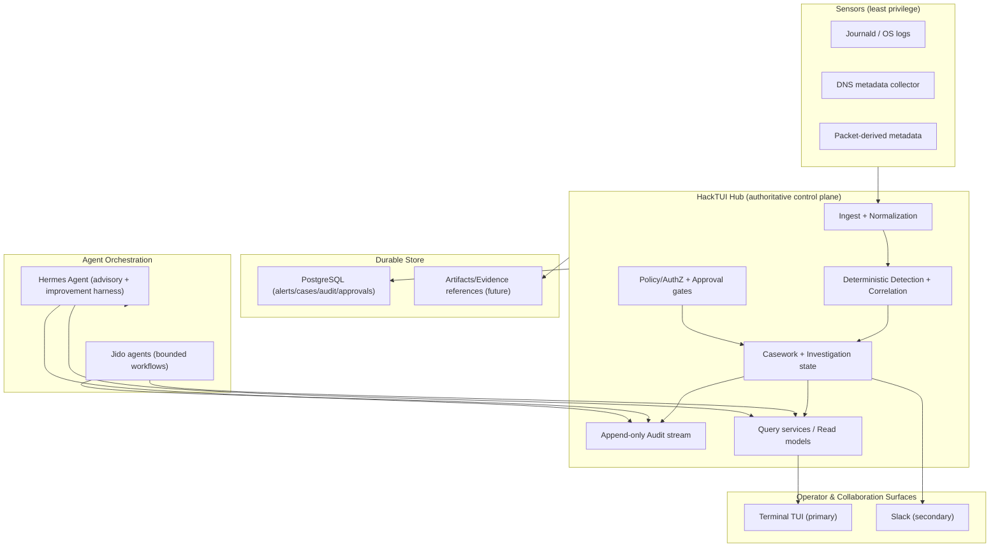
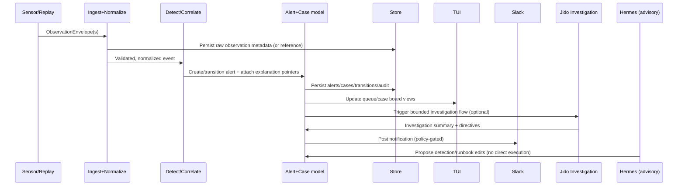

# HackTUI Deep Research Report: Blue/Purple Teaming, SIEM Limitations, and a BEAM-Native Jido/Hermes Stack for Next-Gen Defense

## Executive summary

Security Information and Event Management (SIEM) exists to turn heterogeneous security telemetry into actionable information via a single interface (entity["organization","National Institute of Standards and Technology","us standards agency"]’s glossary definition emphasizes “gather security data… and present that data as actionable information”). citeturn8search0 In practice, modern SOCs often experience the opposite: escalating ingest diversity, ever-growing log volumes, and chronic “alert fatigue” driven by false positives, duplicates, and low-context signals that consume analyst time without improving outcomes. citeturn6search2turn0search1turn6search3

The literature is unusually blunt. A qualitative USENIX study reports SOC practitioners’ experience with extremely high false-positive rates and the operational burden of manual validation. citeturn6search3turn6search7 A 2025 ACM article surveys alert fatigue and mitigation approaches, framing the problem as an interaction between human factors, workflow design, and automation/augmentation limits. citeturn0search1 Classic log management guidance (NIST SP 800-92) stresses the foundational challenges: volume, normalization, retention, integrity, and sustainable operational processes. citeturn6search2turn1search8

Against that backdrop, the HackTUI approach—anchored in Elixir/BEAM runtime properties, explicit bounded contexts, and audit-first workflows—targets the structural causes of SIEM pain, not just UI polish. Elixir processes are isolated; failures do not corrupt other processes, and supervisors can restart crashed workers, supporting long-lived, fault-tolerant pipelines. citeturn2search23turn2search4 The BEAM’s built-in tracing and observability tooling (e.g., `dbg`, `observer`, Trace Tool Builder) lets a defensive platform expose “why the system behaved this way” using runtime evidence, rather than opaque black-box automation. citeturn2search3turn2search12turn2search9

The stack’s differentiator is not “AI everywhere,” but **bounded, auditable orchestration**: Jido defines agents as immutable state machines where `cmd/2` yields an updated agent plus explicit directives (Emit, Schedule, Spawn, Stop, etc.), making external effects declarative and loggable. citeturn0search22turn0search2turn0search6 Meanwhile, entity["organization","Nous Research","ai research org"]’s Hermes Agent is designed as a persistent tool-using agent harness with skills and long-term memory—useful for continuous improvement loops if (and only if) its capabilities are sandboxed, audited, and policy-gated. citeturn0search11turn0search3turn0search7

This report proposes a **prioritized portfolio of novel features** that exploit these strengths to outperform typical SIEM/SOAR/XDR patterns:
- deterministic replay-first detection engineering (reduce regression-driven alert fatigue),
- “proof-carrying” alerts and investigations (explainability grounded in stored evidence),
- purple-team continuous feedback loops mapped to ATT&CK (+ defensive mapping via D3FEND),
- safe-by-default agent assistance with explicit tool scopes and injection-resistant workflows,
- operator-grade live TUI and verifiable Slack collaboration built on the same audited domain model.

These proposals explicitly incorporate modern agent security realities: tool-integrated agents are vulnerable to indirect prompt injection, and the industry now treats prompt injection as a top risk category (entity["organization","OWASP","appsec nonprofit"] LLM Top 10). citeturn5search1turn5search4turn5search0 The recommended design pattern is “untrusted data is never instructions,” enforced through typed tool contracts, minimization/redaction, explicit human approvals, and replayable/auditable trajectories.

The end state is a terminal-first SOC control plane where **the BEAM is the durable security runtime**; Jido/Hermes are additive orchestration and improvement layers—not the source of truth.

## Blue and purple teaming: requirements that tooling rarely satisfies

Blue teaming focuses on detection, investigation, and defensive response coordination inside operational constraints. Purple teaming is the deliberate collaboration loop between offensive simulation and defensive learning—closing gaps quickly by turning adversary emulation into measurable detection and response improvements. citeturn0search24turn0search4turn0search12

Two research-grounded properties matter for purple teaming to work in reality:

First, the feedback loop must be operationally cheap. SANS emphasizes real-time collaboration to accelerate triage and reduce wasted cycles that would otherwise take hours. citeturn0search24 When the loop is expensive—manual data wrangling, fragile parsing, “what query did you run?” ambiguity—organizations revert to one-off exercises and lose compounding learning.

Second, the loop must map to shared taxonomies and evidence. entity["organization","MITRE","us nonprofit research org"] ATT&CK is explicitly designed as a knowledge base of adversary tactics and techniques grounded in real-world observations, widely used to develop methodologies and threat models. citeturn1search2 Purple team outcomes become durable when you can say: “Technique T happened; our sensors observed X; detection rule R fired (or didn’t); analyst action A occurred; remediation step B was approved,” and store that chain as an auditable record.

A key implication for HackTUI: if you treat purple teaming as a first-class product workflow (not an external spreadsheet), you can continuously generate:
- ATT&CK coverage reports,
- reproducible detection regression tests,
- “why we missed it” delta analysis across versions,
- and post-incident improvement tasks that can be validated by replay.

This approach creates a compounding advantage over SIEM deployments that rely primarily on ad hoc dashboards and point-in-time consulting deliverables.

## Why SIEMs struggle: empirical limitations and structural causes

### SIEM’s foundational bottlenecks: volume, normalization, integrity, and operations

NIST’s log management guidance identifies the pragmatic realities: organizations must decide what to log, for how long, how to protect it, and how to analyze it sustainably; the document explicitly targets real-world operational processes, not just collection. citeturn6search2turn1search8

The “SIEM as centralizer” framing is consistent across NIST definitions: SIEM software centralizes logging and analysis to present actionable security data through a single interface. citeturn7search4turn8search0 In practice, centralized logs without strong data models and quality gates often create centralized confusion.

### Alert fatigue and false positives are not edge cases; they are the dominant workload

A USENIX qualitative study reports practitioners’ perspectives on high false positive rates and the need for manual validation. citeturn6search3turn6search7 The 2025 ACM article on alert fatigue reviews the problem through automation and augmentation lenses and surveys mitigation approaches. citeturn0search1 Academic and practitioner work repeatedly shows that the limiting factor is not “can we store more alerts,” but “can we reliably produce fewer, higher-quality, evidence-backed alerts that align to human workflow.” citeturn0search1turn6search23

Common structural drivers (supported by these sources) include:
- low-fidelity detections that trigger frequently without contextual evidence, citeturn0search1turn6search3
- inconsistent log formats and imperfect normalization pipelines, citeturn6search2
- limited correlation across sources and time windows without strong entity modeling. citeturn6search2

### Tool sprawl and fractured truth complicate investigation and governance

Many SOCs operate SIEM + EDR/XDR + SOAR + ticketing + observability, with multiple “semi-sources of truth.” This fragmentation is a major reason investigations become narrative rather than reproducible. The mitigation is not “one vendor,” but a platform architecture where:
- durable records own truth (alerts/cases/audit),
- every surface (TUI, Slack, agents) uses the same command/query model,
- and evidence and provenance are explicit rather than implied.

This is the core architectural bet of HackTUI.

### Agentic augmentation adds new risks: prompt injection and “excessive agency”

Tool-integrated agents are specifically vulnerable to indirect prompt injection: malicious instructions embedded in untrusted content can hijack tool selection or exfiltrate data. citeturn5search4turn5search0turn5search3 OWASP’s LLM Top 10 continues to rank prompt injection as a leading risk category for real systems, not just toy demos. citeturn5search1turn5search5

Therefore, any “Hermes-powered SOC automation” must be designed as:
- **advisory by default**,
- explicitly tool-scoped,
- egress-minimized,
- auditable,
- and approval-gated for state-changing actions.

This aligns with the “bounded orchestration” posture of Jido and with modern risk management guidance for GenAI systems (e.g., the NIST profile for GenAI risk management). citeturn5search2

## Why this particular stack matters: BEAM runtime + Jido orchestration + Hermes Agent + metaprogramming

### Elixir/BEAM: durable concurrency, fault isolation, and introspection as a security feature

Elixir leverages the Erlang VM (BEAM) for low-latency, distributed, fault-tolerant systems; its official documentation stresses isolation and links/supervision as the basis for building fault-tolerant software. citeturn2search2turn2search23turn2search4

Key properties that map directly to SOC platform requirements:

Fault isolation and supervision: If parsers, enrichers, or collectors fail, they can crash independently without corrupting other components; supervisors can restart them. citeturn2search0turn2search23

Runtime forensics: Erlang/OTP’s tracing tooling (`dbg`, observer trace tooling) provides production-friendly introspection primitives to investigate behavior under load, message flows, and process interactions—exactly the kind of evidence a SOC platform should expose about itself. citeturn2search3turn2search9turn2search12

Implication for HackTUI: you can build a SIEM whose internal behavior is itself observable and auditable, reducing “platform mystery” incidents that plague SOC operations.

### Jido: explicit directive-based effects and stateful workflows without “agent theater”

Jido’s official docs describe agents as immutable state structures; the core `cmd/2` operation processes actions and returns an updated agent plus directives for external effects. citeturn0search22 A key architectural gain is that effects are enumerated types (Emit, Schedule, Spawn, RunInstruction, Stop, etc.), making them loggable, enforceable, and testable without requiring opaque autonomy. citeturn0search2turn0search6

For defensive systems, this is important: it creates a formal boundary between:
- deterministic logic that produces conclusions or proposals, and
- side-effect execution (notifications, actions, scheduling) that must be policy-gated.

### Hermes Agent: a persistent, skill-building operator and improvement harness

Hermes Agent is documented as an open-source tool-using agent harness with persistent memory and skill creation, intended to run on a machine you control and integrate with messaging accounts for long-lived operations. citeturn0search11turn0search3turn0search7

In a SOC platform, Hermes is most defensible when treated as:
- a **proposal generator** (draft reports, suggested detections, candidate runbooks),
- a **planner** (build structured plans, gather evidence),
- and a **continuous improvement engine** whose changes require review and tests.

It should not be the primary runtime decision-maker about high-impact actions; prompt injection research and OWASP guidance make that too risky without heavy controls. citeturn5search4turn5search1turn5search2

### Metaprogramming in Elixir: compile-time verification, DSLs, and “detection-as-code” safety rails

Elixir’s official documentation explicitly positions quote/unquote as the foundation for macros and DSL construction. citeturn2search1 In security engineering terms, metaprogramming can be used to:
- define a detection DSL that compiles into pure functions with known complexity,
- enforce schema validation at compile time,
- generate documentation and capability matrices automatically,
- and generate test fixtures and replay harness scaffolding.

This matters because “detection-as-code” fails when the code path is too free-form. Metaprogramming can restrict the surface area by design.

## How HackTUI can outperform existing SIEMs: a prioritized novel feature portfolio

This section assumes “repo-truth” (user-provided) about your current HackTUI umbrella boundaries, DB-backed store via Ecto, terminal-first UI direction, bounded Jido investigation flow, and safe-by-default feature gating. No secrets are stated.

### Comparison table: common SIEM capabilities vs what this stack enables

| Common SIEM capability | Typical implementation reality | What HackTUI (BEAM + Jido + Hermes + macros) can enable |
|---|---|---|
| Centralized log collection + normalization | Works, but normalization is brittle; inconsistent formats persist. citeturn6search2 | Typed “observation envelope” contracts with validation + backpressure under supervision; parsers as isolated workers that can crash safely. citeturn2search23turn2search4 |
| Search and dashboards | Good at large-scale query, often at high cost/complexity (industry observation; varies by vendor). | A “control-plane-first” UI: live operational state (queues, health, audits) + principled, reproducible queries over read models; UI is a supervised process, not an afterthought. citeturn2search23 |
| Correlation and alerting | Often noisy; FP burden is widely reported. citeturn6search3turn0search1 | Deterministic correlation engines + replay-based regression harness to prevent reintroducing noisy detections; “proof-carrying” alert explanations grounded in stored evidence IDs. citeturn6search3turn1search2 |
| Incident response workflows | Many systems bolt on playbooks/tickets; IR guidance stresses integrated lifecycle and learning. citeturn8search2turn8search3 | Runbooks as versioned, testable programs with approvals; auto-generated after-action tasks; continuity aligned to IR playbooks. citeturn8search2turn8search3 |
| Auditability | Often partial or spread across tools; adequate audit is a foundational requirement. | Append-only, first-class audit stream: every action, tool call, directive, Slack delivery, and approval becomes a durable record; BEAM tracing provides additional runtime evidence. citeturn2search3turn2search9 |
| Automation / SOAR | Powerful but risky; “excessive agency” and correctness issues are recurring. | “Directives, not magic”: Jido plans produce explicit effects that can be policy-checked and approval-gated; avoids hidden autonomy. citeturn0search22turn0search2 |
| Purple-team readiness | Often external: spreadsheets, BAS outputs, vendor reports. | Continuous purple-team loop: ATT&CK mapping + detection tests + replay; D3FEND mapping for defensive control goals. citeturn1search2turn4search6turn4search14 |
| Agentic assistance | Increasingly common, but tool-integrated agents are vulnerable to injection and leakage. citeturn5search4turn5search1 | Hermes as advisory + PR generator; read-only tools by default; strict egress; injection-aware pipelines; approvals for sensitive effects. citeturn0search11turn5search4turn5search2 |
| Open telemetry interop | SIEMs often require proprietary ingestion adapters. | Adopt OpenTelemetry logs/OTLP as a canonical ingest option; strong log correlation semantics define unified navigation across signals. citeturn3search2turn3search15turn6search28 |

### Proposed novel features: prioritized list with feasibility notes

Prioritization is based on: (1) near-term operator value, (2) compounding learning loops that reduce future cost, (3) safety and auditability, and (4) fit to current repo boundaries.

#### Highest priority features

Feature: Replay-first detection engineering and regression harness  
Why it outperforms: It turns detection tuning into a reproducible engineering loop, directly targeting false positives and alert fatigue documented in the SOC literature. citeturn6search3turn0search1  
Feasibility: High. BEAM supervision and pure-function correlation modules are ideal for deterministic replay; Elixir macros can enforce DSL constraints. citeturn2search23turn2search1  
Required components: `hacktui_sensor` replay input adapters; `hacktui_hub` replay runner; `hacktui_store` fixture storage; `hacktui_core` deterministic detection/correlation functions.  
Trust/safety: Replay mode is lab-safe and should be default-off for production ingestion; no external egress required.  
Testing: Golden-file tests for expected alerts/cases; property tests for parsers; integration tests against DB.

Feature: Proof-carrying alerts and investigations  
Why it outperforms: Instead of “alert fired because rule X,” each alert includes a structured explanation that references exact evidence artifacts and correlation steps, enabling faster analyst validation and post-incident review; addresses manual-validation pain described by SOC studies. citeturn6search3turn6search23  
Feasibility: Medium-high. Requires careful data modeling but composes well with event-sourced / append-only patterns.  
Required components: Evidence references, correlation outputs, explanation schema; UI support.  
Trust/safety: Explanations must avoid embedding untrusted content as instructions; redaction needed for external sharing. citeturn5search1turn5search4  
Testing: Schema validation tests; “explanation completeness” tests; audit linkage tests.

Feature: Live terminal TUI with operational introspection  
Why it outperforms: A SIEM that exposes its internal health, backpressure, and workflow state reduces “platform mystery” incidents; BEAM tracing and process info can be integrated into operator dashboards. citeturn2search12turn2search9  
Feasibility: High. Terminal UI frameworks exist (e.g., Ratatouille). citeturn3search1  
Required components: a supervised TUI runtime loop; query services for alert/case/approval/audit; health endpoints; optional “runtime telemetry view.”  
Trust/safety: The TUI is a privileged control surface; commands must be authorized and audited.  
Testing: UI snapshot tests (where feasible), plus end-to-end tests of queries/commands; resilience tests (simulate crashed workers).

Feature: Slack as a *verified* secondary interface with delivery audits and approval gates  
Why it outperforms: Many systems send notifications without durable delivery tracking and audit linkage. HackTUI can make Slack actions first-class audited events and treat Slack as non-authoritative, consistent with defensive governance guidance. citeturn8search2turn8search3  
Feasibility: Medium. Requires transport hardening and secrets handling.  
Required components: Slack adapter; delivery receipts; approval interaction model; strict configuration validation.  
Trust/safety: Slack intake is risky; must be disabled by default and fail-closed when misconfigured. Prompt injection risk is relevant if Slack messages feed agent context. citeturn5search1turn5search4  
Testing: HTTP adapter tests; contract tests; “disabled-by-default” tests; infection tests where Slack content is treated as untrusted.

Feature: Bounded agent assistance that is injection-aware and audit-first  
Why it outperforms: Most agent add-ons increase capability without increasing inspectability. Jido directives + Hermes skill system can provide a **structured, inspectable** assistant that proposes improvements and drafts without silently acting. citeturn0search22turn0search11turn5search4  
Feasibility: Medium (policy modeling and logging required).  
Required components: tool catalog with explicit scopes; agent run records; redaction; budget/time limits; approval workflow for non-read-only effects.  
Trust/safety: Must assume indirect prompt injection is possible in any retrieved or pasted content. citeturn5search4turn5search0turn5search1  
Testing: agent “trajectory replay” tests; injection red-team test suite (InjecAgent-style principles); ensure tools never execute unapproved actions.

#### Differentiator features (next tier)

Continuous purple-team loop with ATT&CK coverage + D3FEND defensive mapping  
ATT&CK provides the offensive technique taxonomy; D3FEND provides a defensive technique knowledge graph that maps to sources in cybersecurity literature. citeturn1search2turn4search6turn4search14  
HackTUI can make this operational: each detection, sensor, and runbook declares coverage mappings; replay fixtures validate coverage; dashboards show gaps.

OpenTelemetry/OTLP canonical ingest option for structured logs and correlation  
OpenTelemetry aims to enable correlation and consistent navigation across telemetry signals; OTLP specifies encoding/transport/delivery. citeturn3search2turn3search15turn6search28  
A BEAM-native OTLP receiver (or adapter) yields vendor-neutral ingest and makes “observability-grade” correlation available to SIEM workflows.

Detection-as-code DSL with compile-time validation and Sigma interoperability  
Sigma explicitly targets shareable, generic detection rules across log sources and SIEMs. citeturn1search3turn1search11  
HackTUI can compile a constrained subset of Sigma-like rules into pure Elixir matchers with predictable performance using macros. citeturn2search1

### Table: novel features with complexity, risk, and implementation order

Complexity is engineering effort; risk is primarily safety and correctness risk.

| Proposed feature | Complexity | Risk | Estimated order | Key dependencies |
|---|---:|---:|---:|---|
| Replay-first regression harness | M | Low | 1 | deterministic detection functions; fixture format; replay runner |
| Live operator TUI (dashboards + workflows) | M | Medium | 2 | query services; stable read models; TUI runtime supervision |
| Proof-carrying alerts/explanations | M–L | Medium | 3 | evidence references; schema changes; UI rendering |
| Slack outbound with delivery audit | M | Medium | 4 | secrets handling; adapter tests; durable delivery records |
| Approval-gated response/runbook engine | L | High | 5 | policy model; approvals; audit; safe execution adapters |
| Bounded agent assistance (Jido + Hermes) | L | High | 6 | tool catalog; run records; injection defenses; egress policy |
| Purple-team continuous feedback loop (ATT&CK/D3FEND) | M–L | Medium | 7 | mapping metadata; replay harness; coverage reporting |
| OpenTelemetry/OTLP ingest | L | Medium | 8 | OTLP parsing; schema mapping; throughput/backpressure |
| Detection DSL + Sigma import/export | L | Medium | 9 | macro DSL; translators; compatibility constraints |
| Trajectory replay + forensic introspection for agents | M | Medium | 10 | directive logs; deterministic re-execution harness |

### Mermaid diagrams: target system architecture and core data flow

System architecture (conceptual, aligned to your existing bounded-context approach):

Core data flow, emphasizing replay and evidence-backed explanations:

## Roadmap: phased implementation with safety constraints, verification strategy, and acceptance criteria

This roadmap is built to keep “truthful posture” (no claims without tests), align to incident response guidance, and integrate risk management for external integrations. citeturn8search2turn8search3turn5search2

### Phase: Deterministic demo + replay-first engineering loop

Goal: Make the platform’s behavior reproducible, measurable, and regression-resistant.

Milestones and acceptance criteria:
- Replay runner exists: given a fixture set, the same alerts/cases are produced deterministically on repeated runs.
- A “golden” regression suite runs in CI (no DB and DB-backed variants as appropriate).
- A capability matrix is generated from code + tests (speculative mechanism; recommended).

Safety/trust constraints:
- Replay mode must be offline-capable and should default to no external egress.
- Fixtures must be treated as untrusted input; no dynamic code evaluation.

Verification strategy:
- Golden-file tests for alert IDs, case timelines, explanation payload shapes.
- Property tests for parser stability.
- Integration tests for DB persistence.

### Phase: Operator-grade live TUI

Goal: A security operator can *watch and steer* the system from the terminal.

Milestones and acceptance criteria:
- A supervised “live dashboard” TUI starts reliably and shows:
  - alert queue,
  - case board,
  - approvals inbox,
  - audit explorer,
  - component health.
- Under simulated load (replay), UI remains responsive; system applies backpressure rather than crashing.
- Every TUI command produces an audit record.

Safety/trust constraints:
- TUI is privileged; commands must be authorized and audited.
- Fail-closed: if policy/audit store is unavailable, state-changing commands are blocked.

Verification strategy:
- End-to-end tests: start apps, replay telemetry, assert UI query services reflect correct state.
- Fault injection tests: crash a worker; supervisor restarts; health shows degraded/recovered.

### Phase: Slack as a verified collaboration surface

Goal: Slack notifications and approvals are real, safe, and testable.

Milestones and acceptance criteria:
- Slack outbound transport works with strict config validation and explicit enablement.
- Delivery attempts/results are recorded in the audit log.
- Slack is never the source of truth; Slack actions map to the same domain commands.

Safety/trust constraints:
- Slack intake remains off by default.
- Any Slack-sourced text is untrusted and must not be passed into agent prompts unsafely. citeturn5search4turn5search1

Verification strategy:
- Adapter tests using HTTP mock servers.
- Contract tests for message rendering.
- “Disabled-by-default” tests to ensure no network calls occur without explicit enablement.

### Phase: Approval-gated runbooks and response governance

Goal: Move from “recommend” to “execute safely,” with humans in control.

Milestones and acceptance criteria:
- Runbooks exist as versioned artifacts with:
  - a dry-run/simulation mode,
  - explicit command classes,
  - auditable approvals,
  - idempotent execution adapters.
- Post-execution verification is mandatory (e.g., confirm containment took effect).

Safety/trust constraints:
- Incident response guidance emphasizes structured lifecycle and learning; ensure post-incident tasks are captured. citeturn8search2turn8search3
- High-impact actions require two-person review (speculative but recommended governance).

Verification strategy:
- Integration tests for approval state machines.
- Simulation tests that prove “dry run” never executes effects.
- Chaos tests around missing dependencies.

### Phase: Bounded agent assistance with injection-resistant workflows

Goal: Use Hermes/Jido for structured assistance without creating unsafe autonomy.

Milestones and acceptance criteria:
- Tool catalog has explicit scopes (read-only by default).
- Agent runs record:
  - inputs,
  - tool calls,
  - outputs,
  - directives,
  - and audit links.
- Injection-resilience tests exist (inspired by InjecAgent’s benchmark framing). citeturn5search4turn5search0

Safety/trust constraints:
- Prompt injection is a top risk (OWASP) and must be assumed possible. citeturn5search1turn5search5
- Any outbound communication is explicitly policy-gated (prevents the “private data + untrusted content + exfil channel” failure mode). citeturn5search28turn5search4

Verification strategy:
- Deterministic re-execution of agent trajectories.
- Redaction tests that ensure no secrets or sensitive fields enter prompts or leave via Slack.

## Recommended next engineering tasks in your repo

These are the next five concrete tasks designed to initiate the highest-impact features (replay-first loop + live TUI + verified Slack + safer agent workflows). File paths are written to match your umbrella layout as described (“apps/hacktui_*”).

### Task: Add a canonical observation envelope and validation boundary

Objective: Make every ingest path (sensor, replay, OTLP later) converge to a single validated event model.

Files:
- Create: `apps/hacktui_core/lib/hacktui_core/telemetry/observation_envelope.ex`
- Create: `apps/hacktui_hub/lib/hacktui_hub/ingest/validate_observation.ex`
- Modify: `apps/hacktui_hub/lib/hacktui_hub/query_service.ex` (only if needed for new queries)
Tests:
- Add: `apps/hacktui_core/test/hacktui_core/telemetry/observation_envelope_test.exs`
- Add: `apps/hacktui_hub/test/hacktui_hub/ingest/validate_observation_test.exs`
Commands:
- `mix format`
- `MIX_ENV=test mix do --app hacktui_core test`
- `MIX_ENV=test mix do --app hacktui_hub test`

Safety notes:
- Treat all telemetry as untrusted; reject/record parse failures (aligns with NIST log management operational discipline). citeturn6search2

### Task: Implement replay-first runner and golden regression tests

Objective: Deterministic replay of fixtures into ingest → detection → alert/case state.

Files:
- Create: `apps/hacktui_hub/lib/hacktui_hub/replay/replay_runner.ex`
- Create: `apps/hacktui_sensor/lib/hacktui_sensor/replay/fixture_reader.ex`
- Add fixtures: `apps/hacktui_sensor/priv/replay/case-1/*.jsonl` (or similar)
Tests:
- Add: `apps/hacktui_hub/test/hacktui_hub/replay/replay_runner_test.exs` (golden assertions)
- Add: `apps/hacktui_sensor/test/hacktui_sensor/replay/fixture_reader_test.exs`
Commands:
- `mix format`
- `MIX_ENV=test mix do --app hacktui_sensor test`
- `MIX_ENV=test mix do --app hacktui_hub test`

Feasibility rationale:
- Deterministic replay is a direct, engineering-grade response to documented false-positive burden and alert fatigue. citeturn6search3turn0search1

### Task: Build a supervised live TUI dashboard process

Objective: Provide a real-time operator view: alert queue, case board, approvals, audit, health.

Files:
- Add dependency (if not already): `apps/hacktui_tui/mix.exs` (e.g., Ratatouille). citeturn3search1
- Create: `apps/hacktui_tui/lib/hacktui_tui/live_dashboard.ex`
- Create: `apps/hacktui_tui/lib/hacktui_tui/live_dashboard/supervisor.ex`
- Create: `apps/hacktui_hub/lib/mix/tasks/hacktui.tui.ex` (new mix task entrypoint)
Tests:
- Add: `apps/hacktui_tui/test/hacktui_tui/live_dashboard_test.exs` (startup + render contract)
Commands:
- `mix format`
- `MIX_ENV=test mix do --app hacktui_tui test`
- `iex -S mix` then start hub + tui runtime (exact commands depend on your runtime flags; keep safe defaults)

Runtime evidence rationale:
- BEAM processes/supervision are intended for long-running, fault-tolerant systems; a TUI as a supervised process fits directly. citeturn2search23turn2search4

### Task: Make Slack outbound transport real, minimal, and test-verified

Objective: Verified Slack notifications (outbound only at first), with delivery logging.

Files:
- Create: `apps/hacktui_collab/lib/hacktui_collab/slack/transport_webhook.ex`
- Modify: `apps/hacktui_collab/lib/hacktui_collab/slack/router.ex` (wire transport behind enablement)
- Modify: `apps/hacktui_collab/lib/hacktui_collab/slack/renderer.ex` (ensure stable payload shape)
- Modify: `apps/hacktui_store/lib/hacktui_store/audits.ex` (if needed to record delivery events)
Tests:
- Add: `apps/hacktui_collab/test/hacktui_collab/slack/transport_webhook_test.exs` (mock HTTP)
- Add: “disabled-by-default” test asserting no network calls without explicit enablement
Commands:
- `mix format`
- `MIX_ENV=test mix do --app hacktui_collab test`
- Full suite: `mix test`

Safety rationale:
- Slack is an external interface; strict enablement and auditable delivery outcomes reduce governance gaps. citeturn8search2turn8search3

### Task: Add agent run records + redaction hooks for injection-aware auditing

Objective: Ensure any Hermes/Jido-assisted output is attributable, replayable, and safe to inspect.

Files:
- Create schema + migration: `apps/hacktui_store/priv/repo/migrations/*_create_agent_runs.exs`
- Create: `apps/hacktui_store/lib/hacktui_store/agent_runs.ex`
- Modify: `apps/hacktui_agent/lib/hacktui_agent/investigation_flow.ex` (record run metadata, not secrets)
- Create: `apps/hacktui_agent/lib/hacktui_agent/redaction.ex` (field-level redaction/minimization)
Tests:
- Add: `apps/hacktui_store/test/hacktui_store/agent_runs_test.exs`
- Add: `apps/hacktui_agent/test/hacktui_agent/redaction_test.exs`
Commands:
- `mix format`
- `mix test`
- If DB-backed integration path is enabled in your repo: run the dedicated DB-backed qualification tests as documented in your project (repo-truth).

Security rationale:
- Tool-integrated agents face indirect prompt injection risks; durable audit trails and strict “data vs instructions” separation are non-optional. citeturn5search4turn5search1turn5search0

